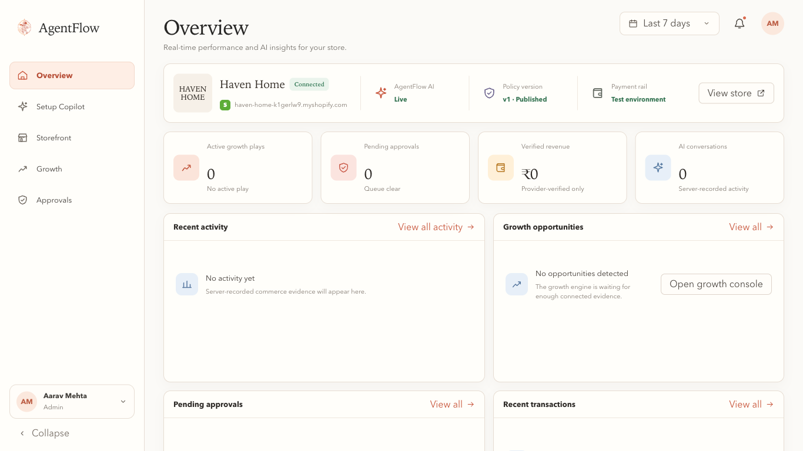

# AgentFlow

AgentFlow is the merchant-side control plane for agentic commerce. It lets a merchant describe how AI may sell, converts that intent into a versioned commercial policy, and gives shoppers a conversational salesperson on Shopify—while deterministic server code retains authority over discounts, approvals, checkout amounts, and payment evidence.

## Live demo

| Surface | Link | Access |
|---|---|---|
| AgentFlow merchant product | [Open AgentFlow](https://agentflow-beige-eight.vercel.app/app/overview) | Buildathon demo |
| Haven Home Shopify store | [Open Haven Home](https://haven-home-k1gerlw9.myshopify.com/) | Storefront password: **demo** |

> Haven Home is a Shopify development store. Use the password above if Shopify shows the storefront password gate.

## Product walkthrough

### Merchant control plane



The merchant workspace combines policy setup, deterministic simulations, human approvals, growth opportunities, connected storefront operations, transactions, and an append-only audit trail.

### Shopper-facing Shopify experience


The AgentFlow storefront assistant helps shoppers discover and compare real Shopify products, maintain a shortlist and cart, negotiate within merchant-defined limits, escalate exceptions for approval, and move to an authorized test checkout.

## What AgentFlow demonstrates

- Natural-language Setup Copilot that proposes typed Policy IR drafts for merchant review.
- Published, immutable policy versions that drive the same runtime, graph, simulation, explanation, and audit evidence.
- Server-authoritative `ALLOW`, `COUNTER`, `ESCALATE`, and `DENY` decisions using canonical product, customer, inventory, and private-economics data.
- A Shopify-native AI salesperson for chat, voice, product discovery, comparison, co-browsing, cart actions, offers, and checkout confirmation.
- Human-in-the-loop approvals with bounded, policy-revalidated merchant counters.
- Growth opportunities and bundles that remain subject to margin and policy constraints.
- Razorpay Test Mode payment execution and provider-verified revenue accounting.
- PostgreSQL persistence, tenant-scoped repositories, and server-originated audit events.

The core principle is simple: **AI may propose. Deterministic policy authorizes. The browser never owns merchant authority.**

The trust boundary is:

```text
Merchant intent → Policy IR → Validator → Published version
               → server runtime → ALLOW / COUNTER / ESCALATE / DENY
```

The browser never supplies policy authority, product cost, canonical stock, or customer segment. The customer surface sends only a session, product, quantity, and offer proposal.

## Local development

```bash
npm install
npm run dev
npm run build
npm run test:backend
```

PostgreSQL is the persistent store when `DATABASE_URL` is configured:

```bash
npm run db:generate
npm run db:migrate
npm run db:seed:demo
# or, for an existing production database:
npm run db:bootstrap:production
```

When no database is configured, local Preview uses the same domain IR and evaluator against a deterministic seeded in-memory repository. This is a development fallback only; deployed persistent state requires PostgreSQL.

## Backend boundaries

- `db/schema.ts` and `drizzle/` define PostgreSQL state and migrations.
- `lib/policy/` contains the typed IR, validator, compiler, precedence, evaluator, explanations, and graph projection.
- `lib/server/repositories/commerce.ts` applies organization ownership constraints to every read and write.
- NIM can propose a draft IR. It cannot publish or authorize a commerce action.
- Customer segment is derived from persisted order history (`orderCount > 0` means repeat).
- Money is stored and evaluated as integer paise; percentages use basis points.

Keep real values in ignored `.env.local` or the deployment secret store. `.env.example` contains names and safe defaults only.

## Shopify customer surface

AgentFlow's real buyer-facing entry point is the Shopify development store, not the legacy `/customer` page. The source for the Shopify app embed and proxy configuration lives in `shopify/`.

```text
Shopify Theme App Embed
        ↓ same-origin /apps/agentflow/*
Shopify App Proxy → /api/shopify/proxy/*
        ↓ signed shop context
AgentFlow server → UCP catalog/cart + deterministic policy runtime
```

The server owns Shopify shop tenancy, anonymous session state, and the mapping from a verified Shopify customer ID to a derived AgentFlow customer segment. The browser may send page hints and a session reference, but never policy economics or customer segment claims.

The storefront chat is provider-backed when NIM is configured. If the provider is unavailable, the API returns an explicit `PROVIDER_UNAVAILABLE` state and never presents a mock answer as live AI. Approvals, payment execution, and the final chat experience continue to use the same server-owned policy and commerce runtime.
